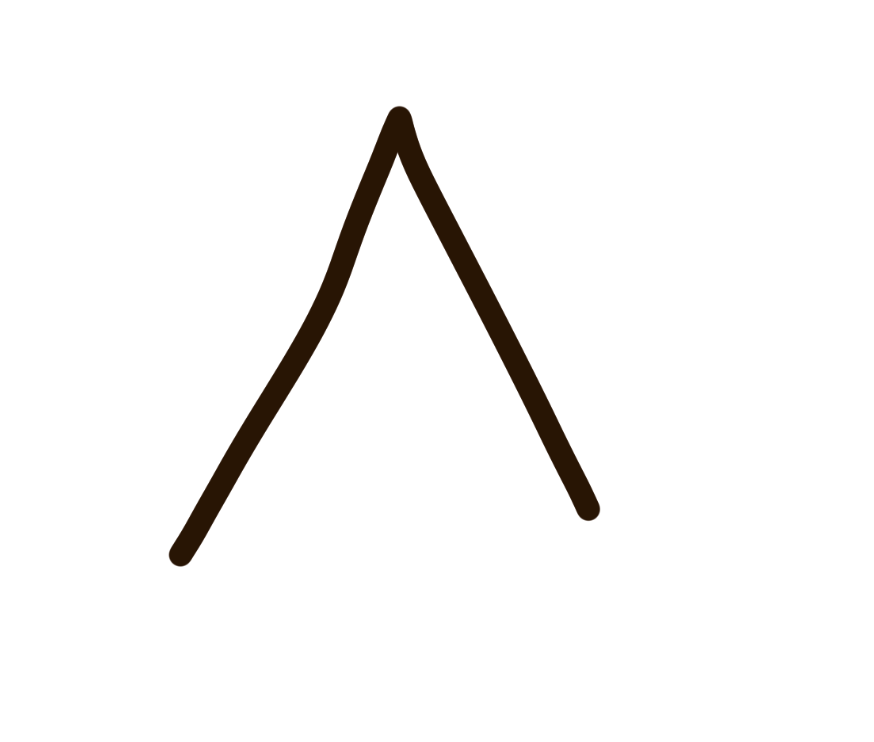
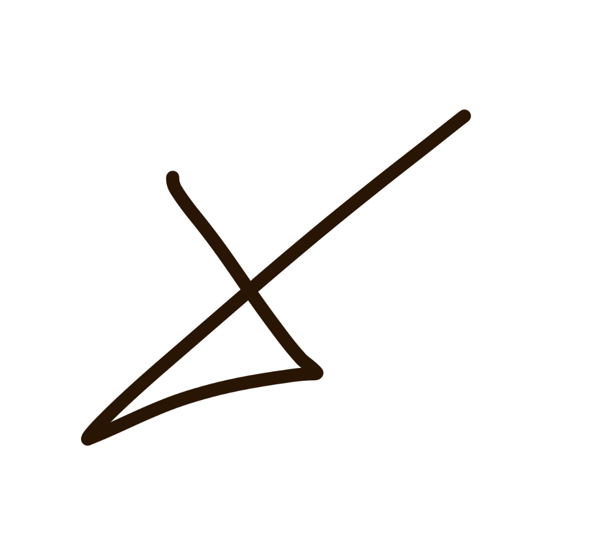

[](https://classroom.github.com/a/b5LOHcJJ)

# Task 1
Call the 1$ recognizer with the following command and draw some gestures with your mouse!

```
python3 dollar_recognizer/gesture_input.py
```

- best recognition with check

# Task 2
## Create your own data

My data is added in dataset/my_data.

You can add your own data with the following command:
```
 python3 my_dataset.py circle
```

- circle represents the gesture you want to draw. If you want to draw for example x gestures just swap it with x. The filename will be adjusted accordingly

While drawing you can do some stuff:

- i you draw a gesture it will automatically be saved as the filename + index if you release the left mouse button.
- to increase the index, press SPACE
- to reset the index to 1, press R
- to quit, press Q

### Example:
1. call python3 my_dataset.py circle
2. draw a circle with your mouse - the file circle01 is created
3. press Space
4. draw a circle with your mouse - the file circle02 is created
5. and so on!


## Comparison
See notebook unistroke-gestures.ipynb


# Task 3 - Game
You are a wizard and fight against three oponents: Hagrid, Dumbeldore and Voldemort!

Call the game with the following command:
```
python3 gesture-application.py True
```

- if you add True, you will use the already saved model in the folder /saved_model_params
- if you add False, the model will be trained again and saved to the same dir


To your disposal you have three spells (gestures):
- Luminus


- avada kedabra





- erase





### Manual:

**The game works like rock, paper, scissors! You can draw a spell and the computer will also attack but, with a random spell. Are you able to deafeat all three wizards?!**


- start the game with SPACE
- go to the next wizard with N
- quit the game with Q
- restart the game with R


### Sources
- hagrid.png: https://i.pinimg.com/originals/9a/ae/48/9aae48d8ec1ae9ea926ee316767f0b00.jpg
- dumbledore.png: https://encrypted-tbn0.gstatic.com/images?q=tbn:ANd9GcSGHM3ehX8OEj-HTL1kjG6sRSnoCPixHzm21Q&s
- voldemort.png: https://encrypted-tbn0.gstatic.com/images?q=tbn:ANd9GcQpX9d6FWRNLkse8hfTdahZMZVZfYcxOr_rjQ&s

Every other image is self created.